# Component Image Gallery

Example `render_component_image` output for every supported family (F-S90). Generated by `cmd/generate-render-samples` from `internal/render.Samples`; the same list backs `TestRenderSamplesMatchCheckedInGallery`, so these images are checked byte-for-byte against what the renderer actually produces, not just illustrative screenshots. Regenerate with `go generate ./internal/render/...` after a rendering change and review the diff before committing.
## Resistors

### resistor_carbon_film_100r

100 Ω, ±5% tolerance, default carbon film body, no caption.

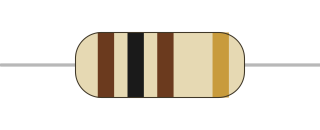

### resistor_carbon_film_4k7_label

4.7 kΩ, ±5%, carbon film, with show_label: the value line above and the type/wattage/band caption below.

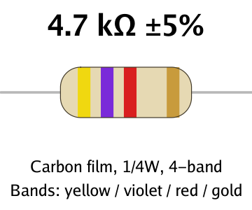

### resistor_metal_film_499r_5band

499 Ω, ±1%, 5-band metal film (blue body is the default for this type).

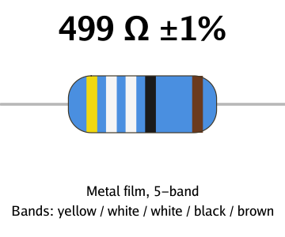

### resistor_sub_ohm_silver_multiplier

0.47 Ω, ±5%: a silver multiplier band and the shorthand-free "0.47 Ω" value line for a sub-1-ohm value.

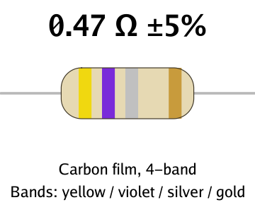

### resistor_10m_1w_metal_film

10 MΩ, ±10%, metal film, 1 W: power_rating_watts with no explicit size picks the larger body preset.

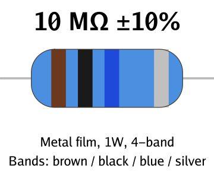

### resistor_custom_body_color

220 Ω, ±5%: body_color_hex overrides the type-derived default color (green here, with carbon_film's caption label unaffected).

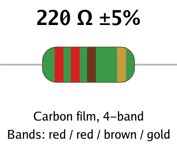

### resistor_vertical_orientation

1 kΩ, ±5%, orientation: vertical — the fully rendered glyph (including the caption) rotated 90 degrees clockwise.

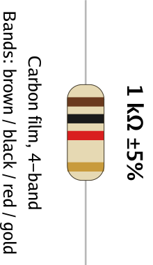

## Diodes

### diode_1n4148_default

Default black body, white cathode band on the left, part-number markings.

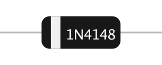

### diode_cathode_right

Same defaults with cathode_side: right, mirroring the band position and marking placement.

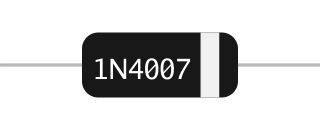

### diode_custom_colors

Custom body_color_hex and cathode_band_color_hex.

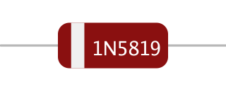

### diode_no_markings

markings is optional; omitting it leaves a plain banded body.

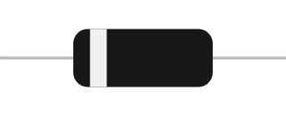

## LEDs

### led_red_clear_5mm

Default 5mm size, red lens, clear (glossy) finish, cathode on the left.

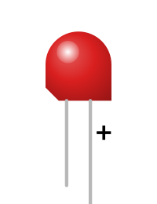

### led_green_diffused

diffused: true gives a matte lens instead of the glossy specular highlight.

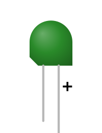

### led_blue_3mm

size: 3mm — a smaller illustrative preset than the 5mm default.

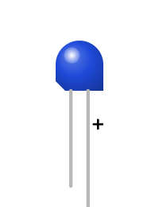

### led_yellow_cathode_right_10mm

size: 10mm, cathode_side: right — the chamfered corner and "+" mark both mirror.

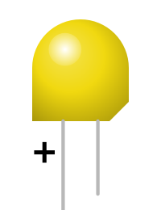

### led_white_with_label

show_label adds a caption with the size, lens color, and lens finish.

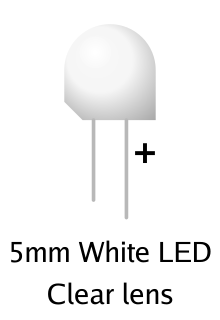

## Capacitors

### capacitor_100uf_16v

Default black body, negative stripe on the left, capacitance and voltage rating printed vertically along the can.

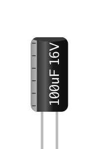

### capacitor_1000uf_35v_blue_right

Custom body_color_hex, negative_side: right, and an extra markings_text line (a series code).

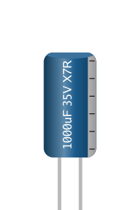

### capacitor_capacitance_only

voltage_rating_v is optional; omitting it prints capacitance alone.

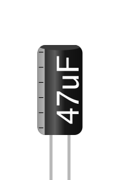

### capacitor_green_body

Another body_color_hex example, showing the cylindrical shading and top-cap disk on a lighter color.

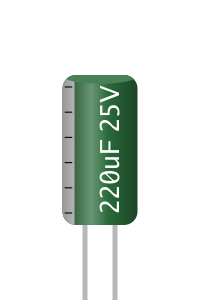

## Fuses

### fuse_2a_fast_horizontal

2 A, default fast speed (straight fusible element), default 5x20mm aspect preset.

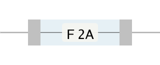

### fuse_1_5a_slow_horizontal

1.5 A, 250 V, speed: slow gives a coiled time-delay element; the rating is printed on an opaque backing panel so it stays legible over the coil.

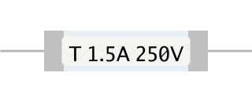

### fuse_500ma_6x30

500 mA (sub-1A ratings format in milliamps), size: 6x30mm aspect preset.

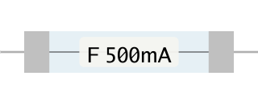

### fuse_3_15a_slow_vertical_transparent

3.15 A, slow, orientation: vertical, background: transparent.

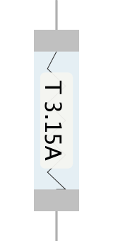

### fuse_custom_cap_color

cap_color_hex overrides the default silver metal end caps.

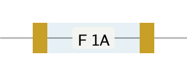

